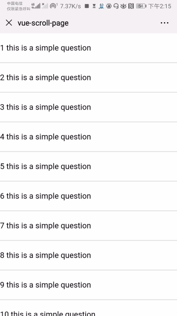

# vue-slip-delete
<p>
  <a href="https://www.npmjs.com/package/vue-slip-delete"></a>
  <a href="https://www.npmjs.com/package/vue-slip-delete"></a>
</p>

vue left slip，左滑删除组件

## 组件迁移至 [Esc-ui](https://competent-bose-f6b47c.netlify.com/#/slide-delete) ，升级为ts写法，按需引入，demo演示。

# demo



# usage
```
npm install vue-slip-delete --save
```

```vue
<template>
  <slip-del
    v-for="(item, i) in list"
    :key="i"
    ref="slipDel"
    @slip-open="slipOpen(index)"
    @slip-close="slipClose(index)"
    @del-click="delFn(index)"
  >
    <div class="demo-item">delete item</div>
    <div slot="del">删除</div>
  </slip-del>
</template>

<script>
import SlipDel from 'vue-slip-delete'

export default {
  components: {
    SlipDel
  },
  methods: {
    slipOpen(vm) {
      // 无需手动关闭
    },
    del() {
      // 删除回调
    }
  }
}
</script>
```
# feature
- [x] 滑动角度判断
- [x] 滑动结束回调
- [x] 低版本兼容

# data
名称|类型|默认值|描述
----|----|----|----
threshold|Number|35|滑动的阀值
delAreaWidth |Number|70|滑块展开宽度

# event
名称|描述
----|----
del-click|点击删除的回调
slip-open|滑动打开后的回调
slip-close|滑动关闭后的回调

# method
名称|描述
----|----
setOpen|手动打开或关闭 删除

# slots
name|描述
----|----
default|条目内容
item `compatible` |条目内容(不推荐)
del|删除


