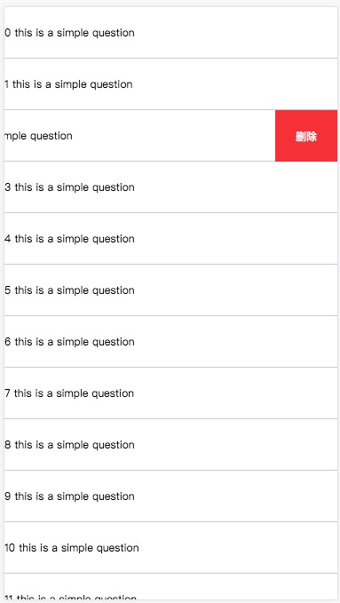

# vue-slip-delete
<p>
  <a href="https://www.npmjs.com/package/vue-slip-delete"></a>
  <a href="https://www.npmjs.com/package/vue-slip-delete"></a>
</p>

vue left slip，左滑删除组件

# usage
```
npm install vue-slip-delete --save
```

```vue
<template>
  <slip-del
    v-for="(item, i) in list"
    :key="i"
    del-text="删除商品"
    @slip-open="slipOpen"
    @del-click="del"
  >
    <div slot="item" class="demo-item">delete item</div>
  </slip-del>
</template>

<script>  
import SlipDel from 'vue-slip-delete'

export default {
  methods: {
    slipOpen(target) {
      // 只允许打开一个左滑删除
      // 收起其他的列表
      Array.from(document.querySelectorAll('.m-slide__top'))
      .filter(x => x.getAttribute('data-open'))
      .forEach(item => {
        if (item !== target) {
          item.style.transform = 'translateX(0)'
        }
      })
      target.setAttribute('data-open', 1)
    },
    del() {
      // 删除回调
    }
  },
  components: {
    SlipDel
  }
}
</script>
```
# feature
- [x]  

# props  
名称|类型|默认值|描述
----|----|----|----
threshold|Number|35|滑动的阀值
del-cls|String|m-slide__del-red|删除按钮的类名
del-text|String|删除|删除文案 

# event
名称|描述
----|----
del-click|点击删除的回调
slip-open|滑动打开后的回调

# demo



